# Silpo AI-Agent — огляд проєкту

Агент, що планує сімейний раціон і збирає кошик через офіційний MCP-сервер Сільпо — від «хочу борщ на вихідні» до готового кошика з реальними товарами, цінами й фото. Побудовано для «Сільпо» AI Factory: Хакатон ідей.

## Проблема

Планування раціону на сім'ю — рутина: підібрати меню під бюджет і обмеження (алергії, вік дітей), знайти *правильні* товари (а не перший-ліпший збіг за назвою), зібрати кошик і не вилізти за бюджет. Зазвичай це робиться вручну, товар за товаром, у кількох вкладках.

## Вхід — власний акаунт Сільпо, не спільний

Кожен гість логіниться у **свій** акаунт Сільпо прямо з клієнта — справжній OAuth-флоу Сільпо, не спільний сервісний акаунт. Агент бачить лише те, на що гість дав згоду, і додає товари в його ж реальний кошик.

| | |
|---|---|
| 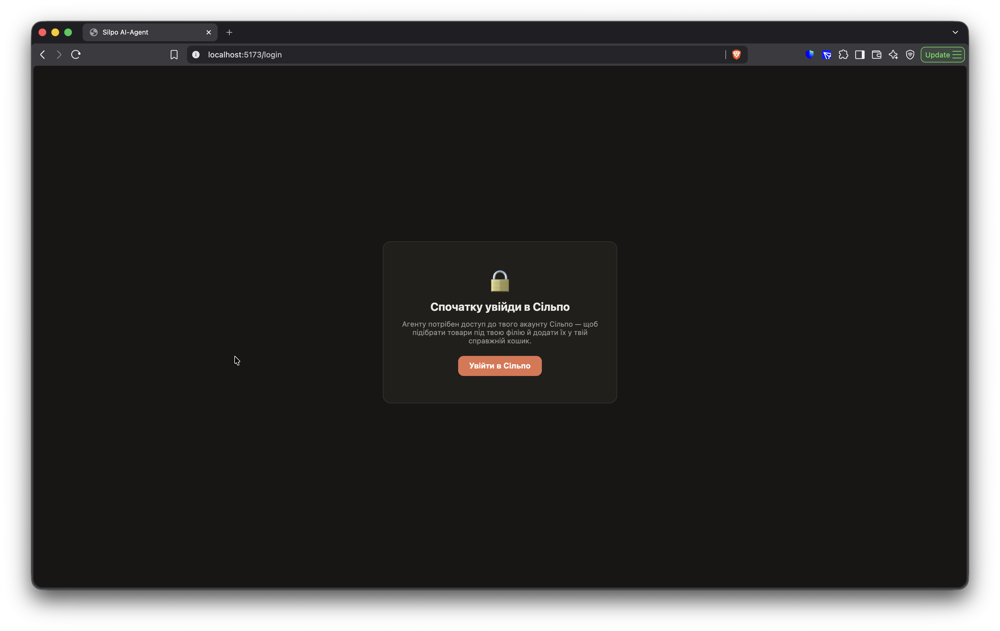 | 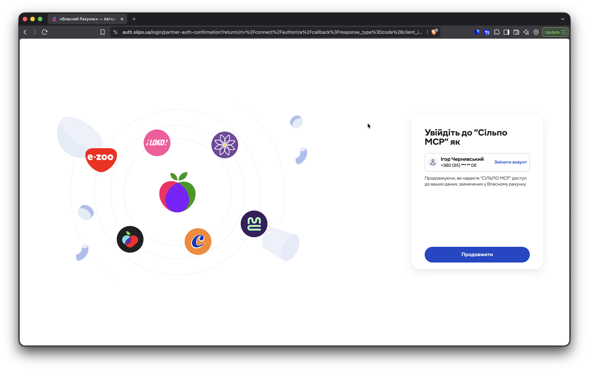 |

Після успішного логіну — чат із трьома швидкими стартами (раціон / страва / набір під подію) або звичайним полем вводу:

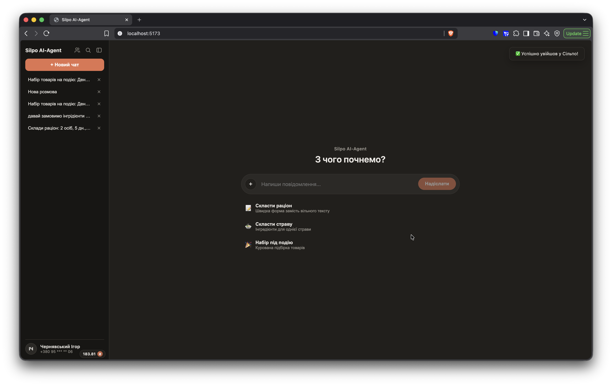

## Що робить агент

### 1. Раціон на кілька днів

Форма закриває базові питання (час доставки, кількість людей/днів, алергени, кухня) одразу, замість того щоб агент перепитував їх у чаті:

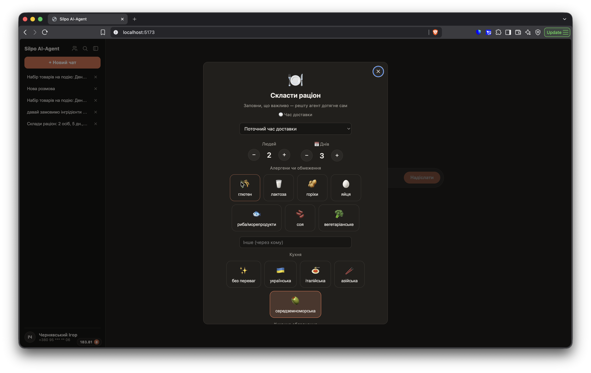

Результат — картки страв під конкретні обмеження (тут: алергії на глютен/горіхи/лактозу + дитяче меню), кожна з реальними товарами, БЖУ й кнопкою купівлі:

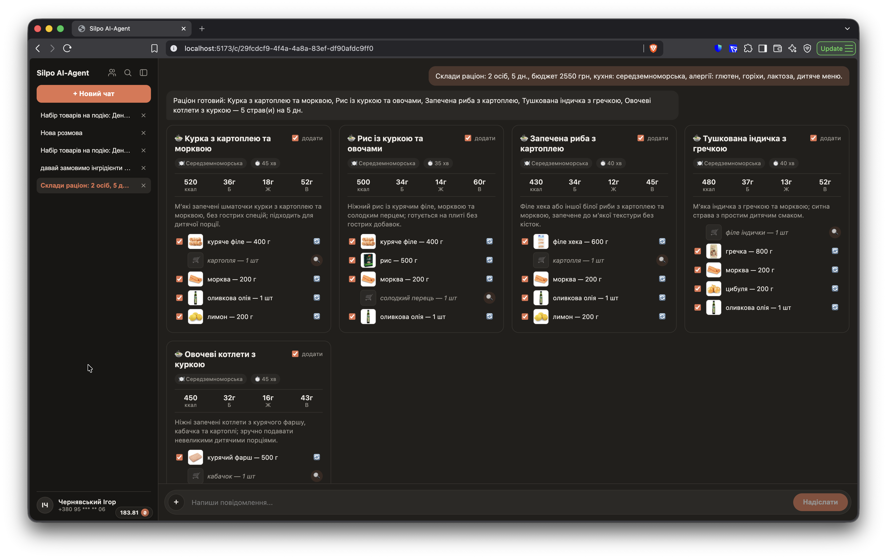

### 2. Одна страва — формою або просто текстом у чаті

Той самий рівень підбору товарів, менший скоуп:

| Форма | Результат у чаті («давай замовимо інгредієнти для класичної лазаньї») |
|---|---|
| 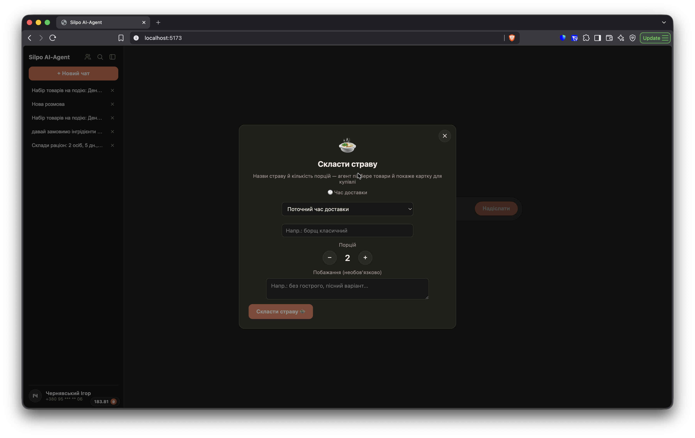 | 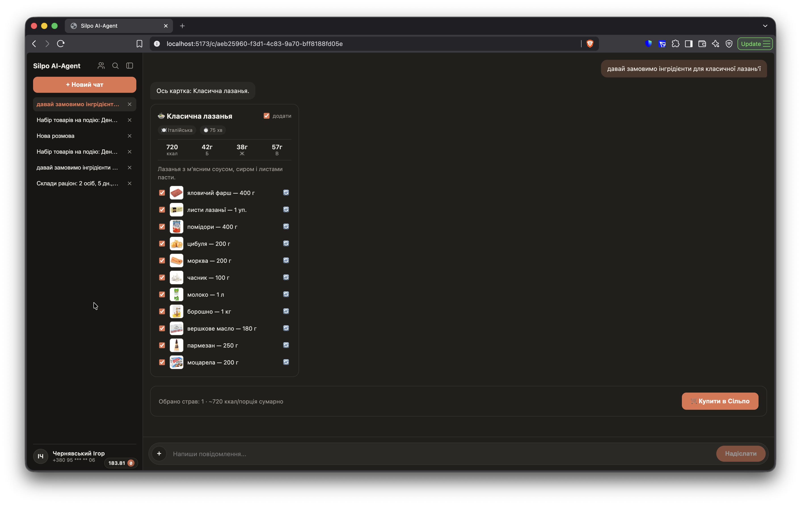 |

### 3. Заміна товару картками, а не текстом

Якщо гість хоче замінити інгредієнт — агент шукає реальні альтернативи і показує їх картками з фото й ціною, а не переліком тексту:

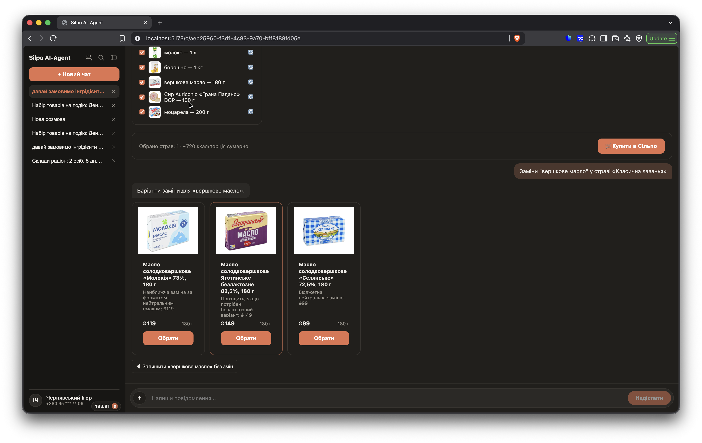

### 4. Набір під подію

Форма закриває бюджет/алкоголь/десерт наперед; агент розрізняє страви, що готуються, і готові товари (закуски/напої/посуд), і може показати обидва в одній відповіді:

| Форма | Результат |
|---|---|
| 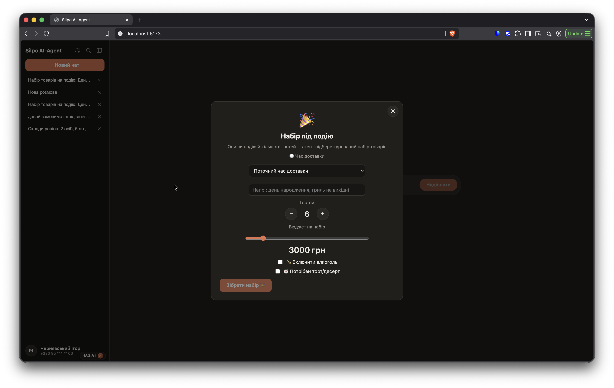 | 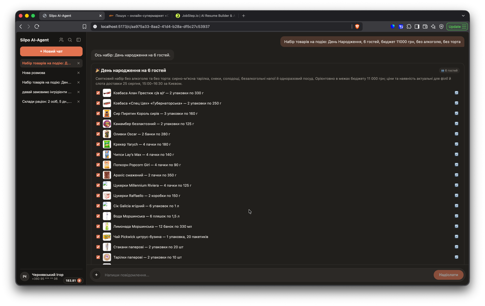 |

Якщо запит прийшов вільним текстом, а не формою — агент сам ставить уточнювальні питання замість вигадування:

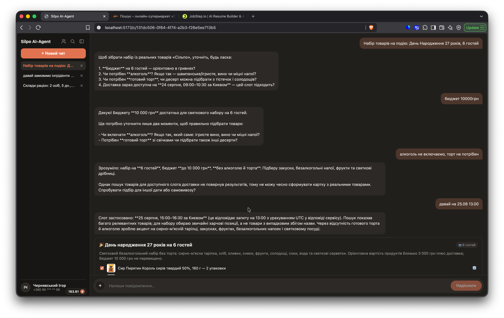

### 5. Сімейний доступ

Акаунти, зв'язані через `silpo_get_my_family`, автоматично отримують спільний сімейний чат — без окремого коду запрошення з нашого боку. Перемикач у sidenav (іконка людей поруч із назвою) міняє весь скоуп чатів між особистими й сімейними:

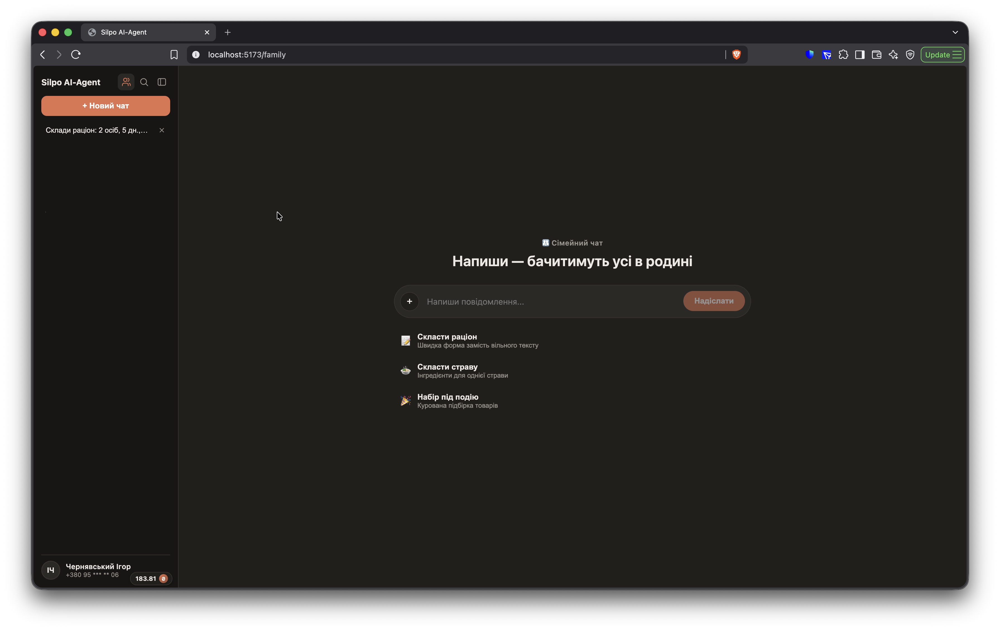

### 6. Профіль, сім'я, доставка — все з акаунту Сільпо

Профіль читає дані з акаунту (лише читання) і дає доступ до модалок сім'ї та доставки:

| Профіль | Моя сім'я |
|---|---|
| 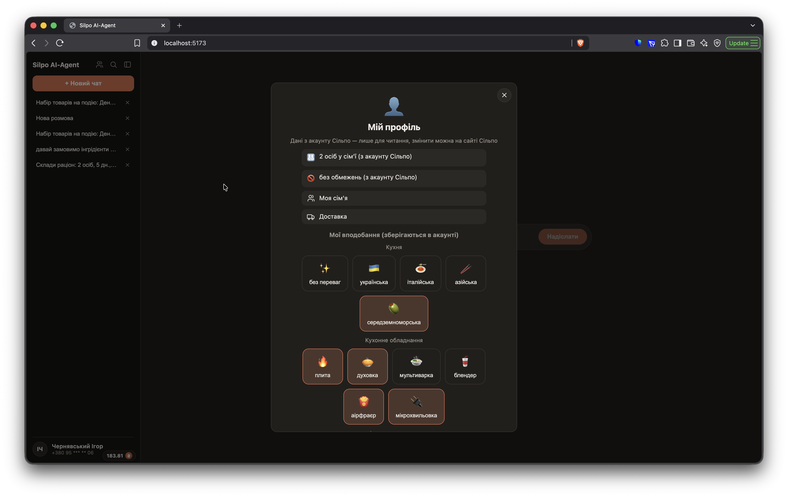 | 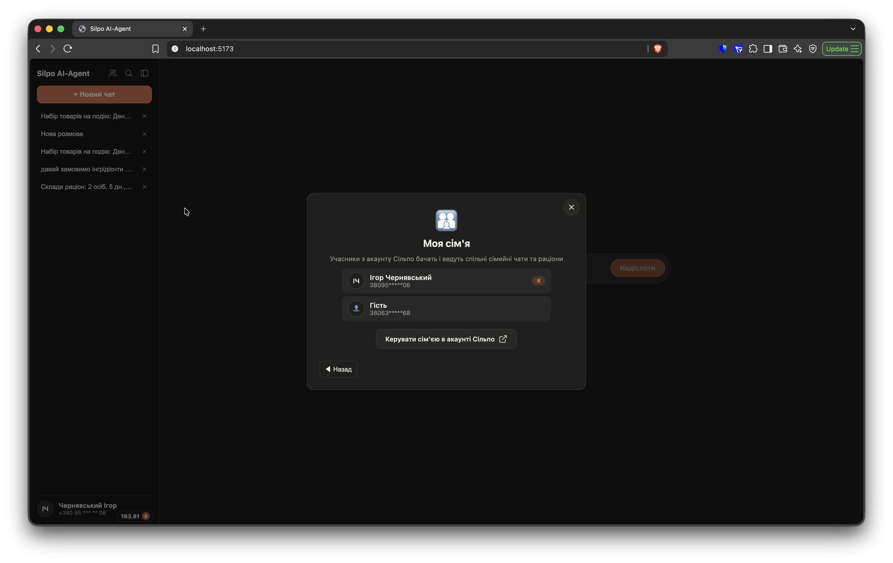 |

Пошук товарів завжди прив'язаний до конкретної філії й таймслоту доставки з реального кошика гостя — раніше це було приховане поле, тепер гість бачить і може змінити адресу (зі збережених у Сільпо):

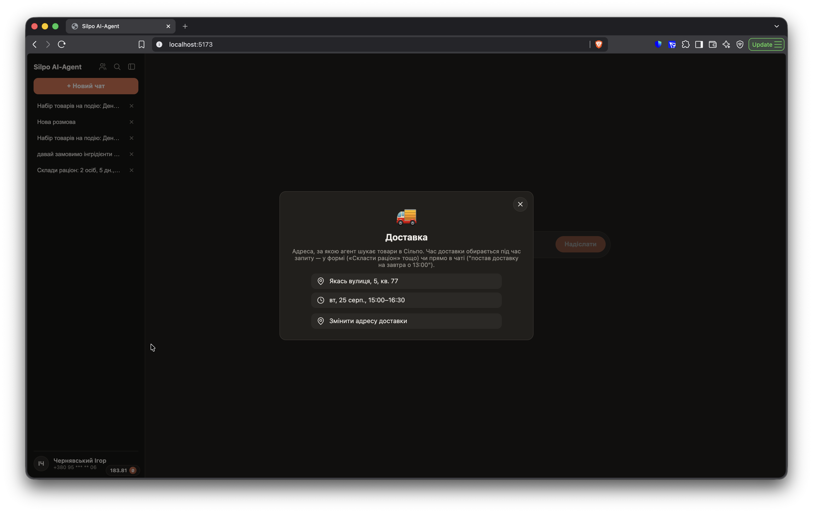

Меню профілю (аватар у sidenav) — налаштування й перемикач теми:

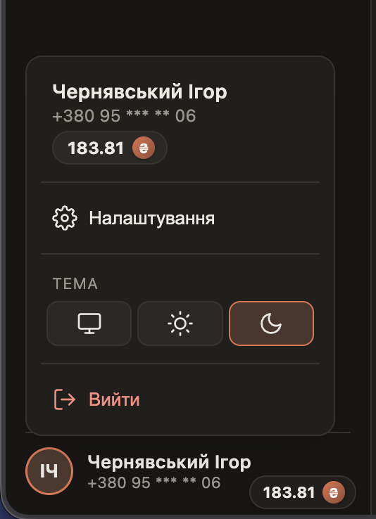

## Архітектура

- **`client/`** — React + Vite + Redux Toolkit/RTK Query. Один екран: sidenav з тредами, картки й бульбашки в одній стрічці.
- **`api/`** — NestJS. Два шляхи до картки:
  - **Lean pipeline** (`plan.ts`/`leanChatRouter.ts`/`leanProductResolver.ts`) — код сам резолвить контекст доставки і шукає товари через MCP; модель лише приймає рішення (яке меню, який товар найкраще підходить) через structured output. Швидше й надійніше за повний tool-use цикл для типових сценаріїв.
  - **Повний MCP tool-use цикл** (`run.ts`) — для відкритих сценаріїв (заміна товару, набір під подію, вільна розмова), де модель сама вирішує, які MCP tools викликати.
- **Мультипровайдерний LLM-шар** (`llm/`) — один інтерфейс `LlmClient` над реальним Claude API, локальними моделями (LM Studio/Ollama/vLLM) і реальним OpenAI API (протестовано на GPT-5.6 Luna) — можна перемкнути провайдера змінною середовища, без зміни коду. Кожен провайдер має власні API-примхи (формат дат, `max_completion_tokens` замість `max_tokens`, відсутність `temperature`, retry на transient rate-limit) — усе інкапсульовано в одному місці.
- **Postgres** — сесії Сільпо, збережені вподобання, чат-треди (messages + widgets).
- **Redis** — кеш `/agent/plan`, щоб повторний запит не платив за модель вдруге.

## Знайдені живим тестуванням edge-кейси

Це те, що робить рішення «агентним», а не обгорткою над API:

- Найдешевший чи перший результат пошуку — системно НЕ правильний товар (корм для тварин, приправи, дитяче харчування на збіг слова).
- Правильний товар іноді ховається в кінці списку кандидатів (позиція 23 з 24) — потрібен повний перегляд, не лише топ-5.
- Багатослівні пошукові запити часто повертають 0 результатів — потрібен фолбек на коротшу форму.
- Доступність товару залежить від конкретного таймслоту доставки, не лише філії — той самий товар може бути в видачі на «сьогодні» і повністю відсутній на «завтра».
- MCP-тула текстового пошуку (`silpo_find_products_batch`) і перегляд категорій (`silpo_get_products`) можуть повертати різні результати для того самого товару на тій самій філії/слоті — знайдено й задокументовано живим тестуванням.

## Стек

NestJS + TypeScript (бекенд), React + Vite + Redux Toolkit (фронтенд), офіційний `@modelcontextprotocol/sdk` (OAuth 2.1 + PKCE до `mcp.silpo.ua`), `@anthropic-ai/sdk`, Postgres, Redis. 240+ unit-тестів, ESLint/Prettier, Husky pre-commit/pre-push.

## Швидкий старт

```bash
docker compose up -d                                             # Postgres :5432 + Redis :6379
cd api && npm install && cp .env.example .env && npm run dev    # HTTP API на :3000
cd client && npm install && npm run dev                          # клієнт на :5173
```

Детальніше: [`api/README.md`](../api/README.md), [`client/README.md`](../client/README.md).
