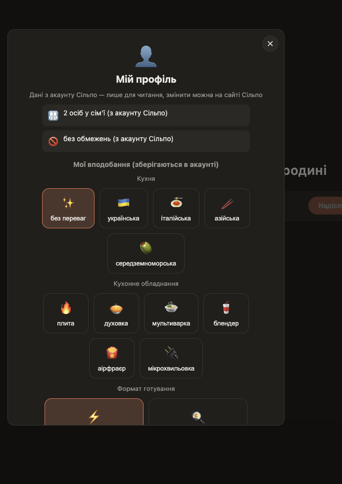

# Silpo AI-Agent — огляд проєкту

Агент, що планує сімейний раціон і збирає кошик через офіційний MCP-сервер Сільпо — від «хочу борщ на вихідні» до готового кошика з реальними товарами, цінами й фото. Побудовано для «Сільпо» AI Factory: Хакатон ідей.

## Проблема

Планування раціону на сім'ю — рутина: підібрати меню під бюджет і обмеження (алергії, вік дітей), знайти *правильні* товари (а не перший-ліпший збіг за назвою), зібрати кошик і не вилізти за бюджет. Зазвичай це робиться вручну, товар за товаром, у кількох вкладках.

## Що робить агент

Один чат, один Postgres-тред на розмову — картковий раціон і вільний текст живуть поруч, не в паралельних режимах.

### 1. Раціон на кілька днів

Форма (бюджет, дні, алергени, кухня, обладнання, дитяче меню) або просто текст у чаті — агент читає профіль гостя прямо з акаунту Сільпо (`silpo_get_my_family`, `silpo_get_my_food_restrictions`), будує меню, шукає реальні товари під кожен інгредієнт і показує картки страв із БЖУ, фото та кнопкою купівлі.

### 2. Одна страва або набір під подію

Той самий пайплайн, менший скоуп: «борщ на 4 порції» чи «набір на день народження, 6 гостей». Для подій агент розрізняє страви, що готуються (рецепт), і готові товари (закуски/напої/посуд) — і може показати обидва в одній відповіді.


*Агент сам ставить уточнювальні питання, коли даних бракує, і одразу застосовує обраний слот доставки.*


*Кожна позиція — реальний товар Сільпо з `productId`, ціною і фото, у межах заявленого бюджету.*

### 3. Заміна товару картками, не текстом

Якщо для інгредієнта немає впевненого збігу — гість бачить кнопку "🔍 знайти варіанти" замість тихо пропущеного товару. Агент шукає ширше (інші бренди/фасування/категорії) і пропонує 2-3 реальні варіанти картками з фото й ціною.

### 4. Сімейний доступ

Акаунти, зв'язані через `silpo_get_my_family`, автоматично отримують спільний сімейний чат — без окремого коду запрошення з нашого боку. Перемикач у sidenav міняє весь скоуп чатів між особистими й сімейними.


*Список учасників з акаунту Сільпо, номери телефонів замасковані (і на бекенді — повний номер ніколи не покидає сервер).*

### 5. Доставка під контролем гостя

Пошук товарів завжди прив'язаний до конкретної філії й таймслоту доставки. Раніше це було приховане поле кошика — тепер гість бачить і може змінити адресу (зі збережених у Сільпо) чи час доставки прямо з візарда запиту, замість застрягати на слоті з нульовим залишком товару.


*Дані з акаунту Сільпо (лише читання) + вподобання, що зберігаються в агента.*

## Архітектура

- **`client/`** — React + Vite + Redux Toolkit/RTK Query. Один екран: sidenav з тредами, картки й бульбашки в одній стрічці.
- **`api/`** — NestJS. Два шляхи до картки:
  - **Lean pipeline** (`plan.ts`/`leanChatRouter.ts`/`leanProductResolver.ts`) — код сам резолвить контекст доставки і шукає товари через MCP; модель лише приймає рішення (яке меню, який товар найкраще підходить) через structured output. Швидше й надійніше за повний tool-use цикл для типових сценаріїв.
  - **Повний MCP tool-use цикл** (`run.ts`) — для відкритих сценаріїв (заміна товару, набір під подію, вільна розмова), де модель сама вирішує, які MCP tools викликати.
- **Мультипровайдерний LLM-шар** (`llm/`) — один інтерфейс `LlmClient` над реальним Claude API, локальними моделями (LM Studio/Ollama/vLLM) і реальним OpenAI API (протестовано на GPT-5.6 Luna) — можна перемкнути провайдера змінною середовища, без зміни коду. Кожен провайдер має власні API-примхи (формат дат, `max_completion_tokens` замість `max_tokens`, відсутність `temperature`, retry на transient rate-limit) — усе інкапсульовано в одному місці.
- **Postgres** — сесії Сільпо, збережені вподобання, чат-треди (messages + widgets).
- **Redis** — кеш `/agent/plan`, щоб повторний запит не платив за модель вдруге.

## Знайдені живим тестуванням edge-кейси

Це те, що робить рішення «агентним», а не обгорткою над API:

- Найдешевший чи перший результат пошуку — системно НЕ правильний товар (корм для тварин, приправи, дитяче харчування на збіг слова).
- Правильний товар іноді ховається в кінці списку кандидатів (позиція 23 з 24) — потрібен повний перегляд, не лише топ-5.
- Багатослівні пошукові запити часто повертають 0 результатів — потрібен фолбек на коротшу форму.
- Доступність товару залежить від конкретного таймслоту доставки, не лише філії — той самий товар може бути в видачі на «сьогодні» і повністю відсутній на «завтра».
- MCP-тула текстового пошуку (`silpo_find_products_batch`) і перегляд категорій (`silpo_get_products`) можуть повертати різні результати для того самого товару на тій самій філії/слоті — знайдено й задокументовано живим тестуванням.

## Стек

NestJS + TypeScript (бекенд), React + Vite + Redux Toolkit (фронтенд), офіційний `@modelcontextprotocol/sdk` (OAuth 2.1 + PKCE до `mcp.silpo.ua`), `@anthropic-ai/sdk`, Postgres, Redis. 240+ unit-тестів, ESLint/Prettier, Husky pre-commit/pre-push.

## Швидкий старт

```bash
docker compose up -d                                             # Postgres :5432 + Redis :6379
cd api && npm install && cp .env.example .env && npm run dev    # HTTP API на :3000
cd client && npm install && npm run dev                          # клієнт на :5173
```

Детальніше: [`api/README.md`](../api/README.md), [`client/README.md`](../client/README.md).
